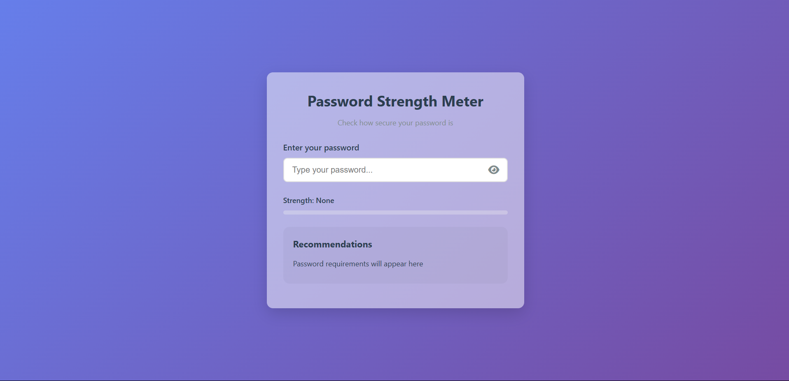
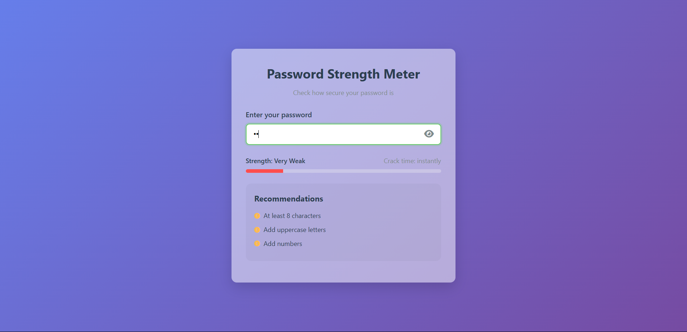
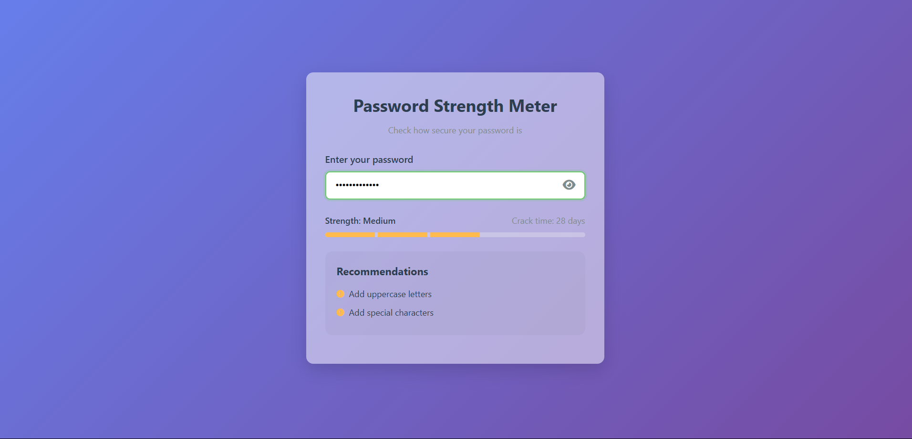
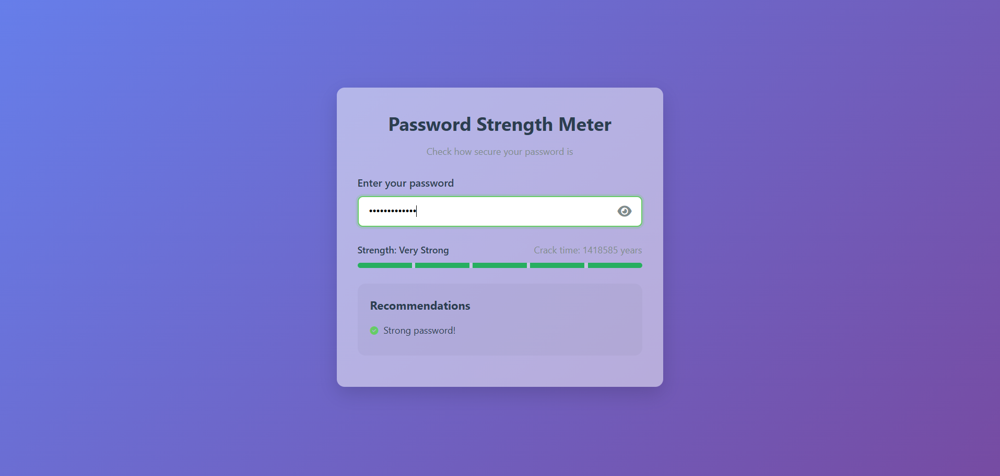

<h1 align="center">🔐 Password Strength Meter</h1>

````markdown
# 🔐 Password Strength Meter

This is a web-based Password Strength Meter built with  `Flask` which helps users evaluate the strength of their passwords in real time. It provides visual feedback, suggestions for improvement, and estimates how long it would take to crack the password.

---

## 🧠 Purpose

- Help users create `stronger, more secure passwords`.
- Educate users on what makes a good password (length, complexity, character variety).
- Estimate `crack time` using entropy-based calculations.

---

## 🔍 How It Works

- Users enter a password in the input field.
- The app checks:
  - Length
  - Use of uppercase/lowercase
  - Digits
  - Special characters
  - Common patterns (like `123`, `abc`, `password`, etc.)
- A strength bar updates dynamically with visual cues:
  - **Weak**
  - **Moderate**
  - **Strong**
- Suggestions are shown to improve password security.
- Crack time estimation shows how long it would take to guess the password.

---

**Labels:**  
🟥 Weak  🟨 Moderate  🟩 Strong
````

📦 Installation (Local)

1. Clone the Repository

```bash
https://github.com/Ravi2718/Password_Strength_Meter.git
cd Password_Strength_Meter
```
### 2. Create a Virtual Environment (Optional but Recommended)

```bash
python -m venv venv
source venv/bin/activate  # On Windows: venv\Scripts\activate
```

### 3. Install Required Packages

```bash
pip install -r requirements.txt
```

---
<h3 align="center">🔑 Enter your password</h3>



<h3 align="center">🔴 <strong>Weak password</strong></p>



<h3 align="center">🟡 <strong>Moderate password</strong></p>



<h3 align="center">🟢 <strong>Strong password</strong></p>




## 🚀 Run Locally

```bash
python app.py
```

Visit: [http://127.0.0.1:5000](http://127.0.0.1:5000)

---

## 🌐 Deployment on Render

1. Push the code to GitHub.
2. Go to [https://render.com](https://render.com) and create a new **Web Service**.
3. Use these settings:

| Field         | Value                             |
| ------------- | --------------------------------- |
| Environment   | Python                            |
| Build Command | `pip install -r requirements.txt` |
| Start Command | `gunicorn app:app`                |

Ensure your `app.py` includes:

```python
import os

if __name__ == '__main__':
    port = int(os.environ.get("PORT", 5000))
    app.run(host='0.0.0.0', port=port)
```

Render will give you a live link after deployment.

---

## 🛠 Tech Stack

* Flask (Python)
* HTML + CSS
* JavaScript
* Gunicorn (for deployment)

---

## 📄 License

MIT License

Copyright (c) 2025 

Permission is hereby granted, free of charge, to any person obtaining a copy...


---

## 🙋 Author

**Ravi2718**
This is a fun educational project — feel free to fork and enhance it!

```

📝 Note

- This tool is for educational and demonstration purposes only.
- It estimates password strength locally and does not store or transmit any data.
- For production use, consider integrating with more advanced password strength libraries or APIs.

```
